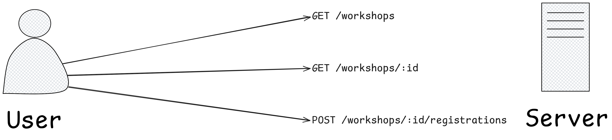

# Effect in practice: building a type-safe, composable, and robust HTTP API in TypeScript

Effect brings concepts such as explicit error handling, dependency injection, schema-based validation, and functional
composition to TypeScript.

In this workshop, we'll build a small HTTP API using Effect. After a brief introduction to the core concepts, we'll dive
straight into the code: endpoints, request validation, error modeling, application services, and composition through
layers.

The workshop is designed for TypeScript developers who want to understand, hands-on, how Effect can help them build
applications that are more robust, testable, and maintainable.

## Table of contents

- [Getting Started](#getting-started)
- [Part 1: Effect basics](#part-1-effect-basics)
    - [Solution](#solution)
- [Part 2: Building an HTTP API with Effect](#part-2-building-an-http-api-with-effect)
    - [Data](#data)
    - [Commands](#commands)
    - [Solution](#solution-1)
- [Other commands](#other-commands)
- [Editor/IDE setup](#editoride-setup)
    - [Vs Code](#vs-code)
    - [Webstorm](#webstorm)
- [Links](#links)

## Getting Started

Install [Node.js](https://nodejs.org/en/download) >= 24 and the [pnpm](https://pnpm.io/11.x/installation) v11 package
manager.

Install dependencies:

```shell
pnpm install
```

Then run the tests and verify they are failing:

```shell
pnpm run test:api:e2e
```

## Part 1: Effect basics

An introduction to the core concepts of Effect that you will need to build the HTTP API later on.

See [src/exercises/1-basics](./src/exercises/1-basics).

Run any TypeScript file with Node.js:

```shell
node ./src/exercises/1-basics/01-effect.ts
```

### Solution

You can find a reference TODO application in [src/solutions/1-basics](./src/solutions/1-basics) where all the concepts
of this section are used. You can also find some unit tests to see how you can test Effect programs.

## Part 2: Building an HTTP API with Effect

You will build an HTTP API that allows a user to list workshops, view their details, and register for one.



The [end-to-end tests](./src/common/api-e2e-tests.ts) have two purposes: they verify your implementation, and they
document the contract of each endpoint, for both successful and error responses.

Once you've read them, start writing code in [src/exercises/2-api/router.ts](./src/exercises/2-api/router.ts)!

### Data

You can find workshop fixtures in [static-workshops.ts](./src/common/static-workshops.ts)

### Commands

- Start the HTTP server in watch mode: `pnpm run start:api` (http://localhost:3000)
- Run unit tests: `pnpm run test:api`
- Run end-to-end tests: `pnpm run test:api:e2e`

### Solution

If you are stuck or would like to see how it could be implemented, check out the [solutions](./src/solutions/2-api)
directory.

## Other commands

Type check:

```shell
pnpm run typecheck
# or watch mode
pnpm run typecheck:w
```

Test in watch mode:

```shell
pnpm run test:w:<type-of-tests> # e.g. pnpm run test:w:api:e2e
```

Execute any TypeScript file:

```shell
node ./src/path/to/file.ts
```

Linter (useful advice from [Effect LSP](https://effect.website/docs/v4/getting-started/devtools)):

```shell
pnpm run lint
```

Format code:

```shell
pnpm run format
```

## Editor/IDE setup

### Vs Code

1. Install [recommended extensions](./.vscode/extensions.json)
2. Allow the [TypeScript settings](./.vscode/settings.json) to leverage the Effect LSP.

### Webstorm

1. Install [OXC plugin](https://plugins.jetbrains.com/plugin/27061-oxc) for linter
2. Settings > Languages & Frameworks > Typescript > In the "Typescript" dropdown, select the repository TypeScript in
   `node_modules` to leverage the Effect LSP.

## Links

- Effect V4: https://effect.website/docs/v4/onboarding
